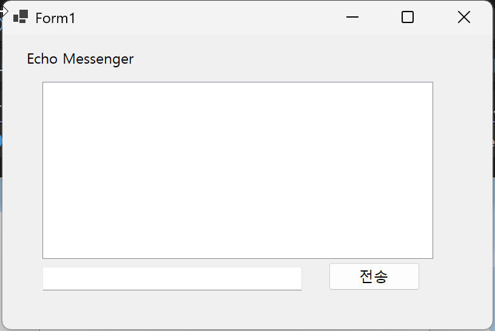
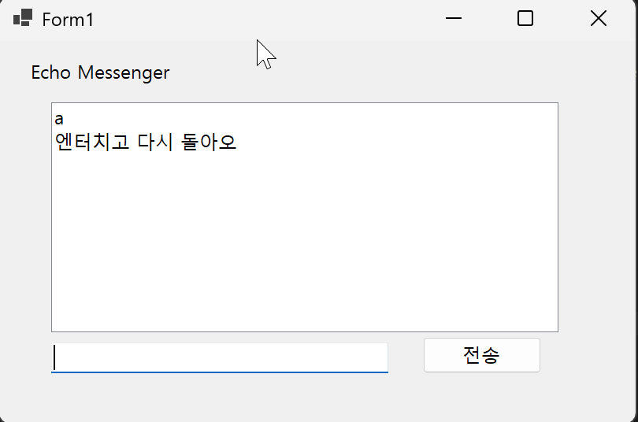
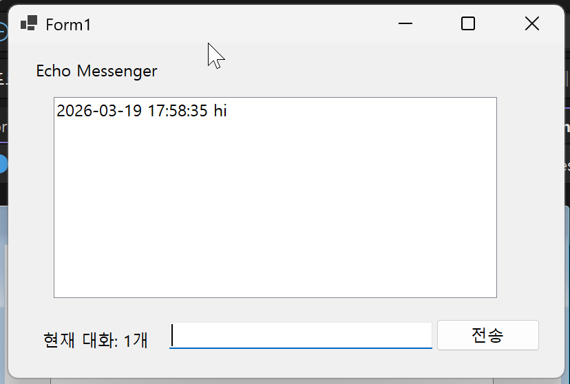
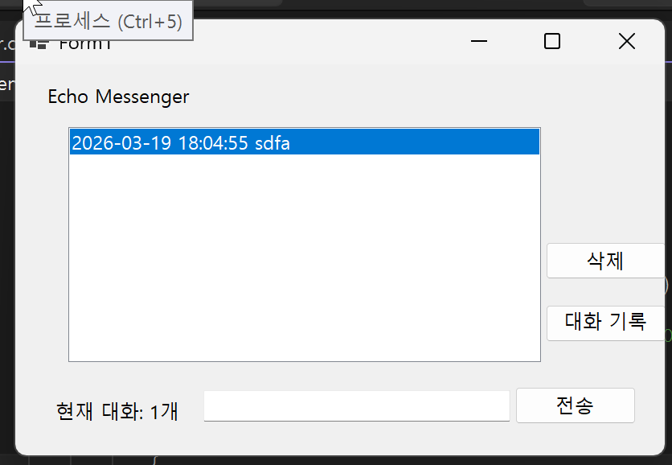
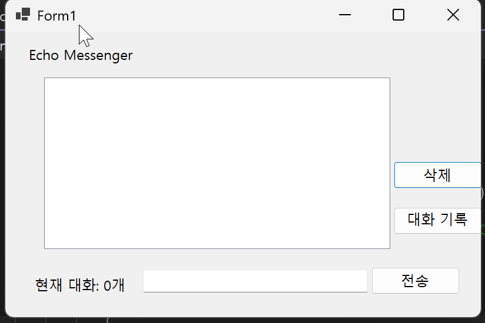
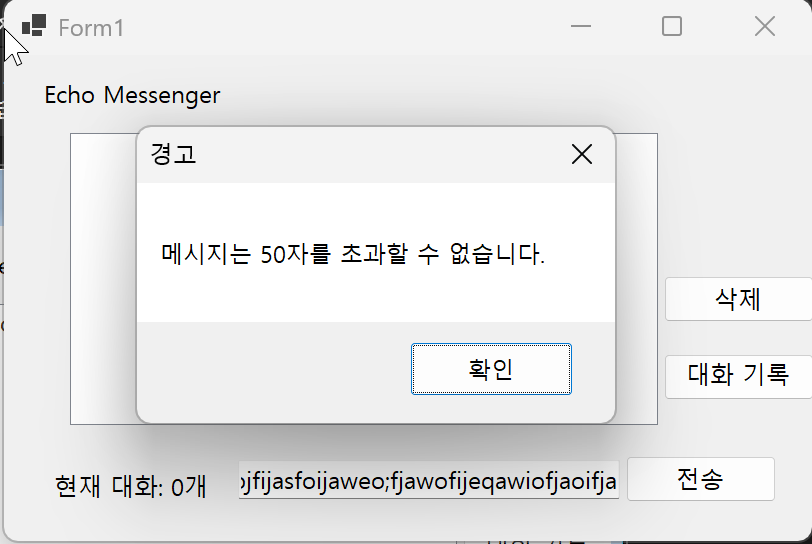

# (C# 코딩) 에코 메신저

## 개요
- C# 프로그래밍 학습
- 1줄 소개: WinForms 기반으로 사용자 입력 데이터를 실시간으로 처리하고 관리하는 메신저 애플리케이션
- 사용한 플랫폼:C#, .NET Windows Forms, Visual Studio, GitHub
- 사용한 컨트롤:Label, TextBox, ListBox, Button
- 사용한 기술과 구현한 기능:
1. Visual Studio를 이용하여 폼 UI 디자인 구성
2. string 클래스의 `Trim()`, `IsNullOrWhiteSpace()`, `Length` 속성을 이용한 데이터 정제 및 예외 처리
3. `DateTime.Now`를 이용한 실시간 타임스탬프 정보 결합
4. 키보드 `KeyDown` 이벤트와 포커스(`Focus()`) 제어를 통한 사용자 편의성(UX) 개선
5. ListBox의 `Items` 컬렉션을 활용한 데이터 항목 추가, 선택 삭제(`RemoveAt`), 전체 초기화(`Clear`) 및 동적 카운팅 구현

## 실행 화면 (과제1)
- 과제1 코드의 실행 스크린샷
- 

## 과제 내용
- Label, TextBox, Button, ListBox의 적절한 배치 및 네이밍 적용
- Button의 Click 이벤트와 ListBox의 Items 속성을 연동하여 데이터 전달
- 메시지 전송 직후 입력창(TextBox)의 상태를 초기화하여 연속적인 사용자 입력을 지원

## 구현 내용과 기능 설명
- **데이터 흐름 제어:** 사용자가 `txtMessage`(입력창)에 텍스트를 입력하고 `btnsend`(전송 버튼)를 클릭하면, 해당 텍스트 데이터가 `lstMsgWindow`(리스트 박스)의 Items에 추가되어 화면에 즉시 렌더링됨.
- **UX 초기화:** 텍스트가 대화창으로 전달된 직후, `txtMessage.Clear()` 메서드가 호출되어 입력창의 텍스트가 지워지며 다음 입력을 대기 상태로 만듦.
- **자동 스크롤 지원:** 대화가 누적되어 ListBox의 표시 범위를 초과할 경우, 내장된 기능에 의해 세로 스크롤바가 자동으로 생성되어 이전 대화 기록을 확인할 수 있음.

사용한 기술과 구현한 기능: Button의 Click 이벤트를 통해 TextBox의 문자열을 ListBox의 Items 컬렉션으로 전달하고, Clear() 메서드로 입력창을 초기화하는 기본 데이터 출력 기능을 구현했습니다.

## 실행 화면 (과제2)

## 과제 내용
- 전송이 끝나면 입력창에 남겨진 기존 메시지를 삭제합니다.
- 전송 후에 마우스로 입력창을 다시 클릭하지 않아도 되도록 커서를 자동으로 입력창에 둡니다.
- 마우스 클릭 대신 키보드의 Enter 키를 눌러도 메시지가 전송되도록 합니다.
- 내용이 없는 빈 문자열이나 공백(Space)만 있을 때는 메시지가 전송되지 않도록 방지합니다.

## 구현 내용과 기능 설명
- **입력 데이터 검증(Validation):** `string.IsNullOrWhiteSpace()` 메서드를 적용하여 의미 없는 공백 데이터가 ListBox에 추가되는 것을 사전에 차단했습니다.
- **UX 개선 (포커스 및 단축키):** 메시지 전송 후 `txtMessage.Focus()`를 호출하여 사용자의 타이핑 흐름이 끊기지 않게 하였으며, 입력창의 `KeyDown` 이벤트를 통해 Enter 키를 전송 트리거로 연동하여 키보드만으로도 원활한 채팅이 가능하도록 구현했습니다.

사용한 기술과 구현한 기능:string.IsNullOrWhiteSpace()를 통한 빈칸 검증, Focus() 메서드를 활용한 커서 자동 유지, 그리고 KeyDown 이벤트를 이용한 Enter 키 전송 기능을 구현하여 사용자 편의성을 높였습니다.

## 실행 화면 (과제3)

## 과제 내용
- 메시지 앞에 현재 시간 정보(타임스탬프)를 자동으로 결합하여 리스트에 출력합니다.
- 현재 리스트에 쌓인 총 메시지 개수를 계산하여 화면 하단 Label에 실시간으로 업데이트합니다.
- 사용자가 입력한 메시지의 앞뒤 불필요한 공백을 Trim() 함수로 제거하여 저장합니다.

## 구현 내용과 기능 설명
- **데이터 가공 및 정제:** `string.Trim()` 메서드를 사용하여 사용자가 실수로 입력한 앞뒤 불필요한 공백을 제거했습니다.
- **상태 추적 및 실시간 피드백:** 메시지 데이터가 추가될 때마다 `ListBox.Items.Count` 속성으로 컬렉션 내부의 총항목 개수를 동적으로 계산했습니다. 이를 `lblCount`(Label) 컨트롤의 텍스트에 즉시 반영하여, 사용자에게 현재 누적된 대화 개수를 직관적으로 제공합니다.\

사용한 기술과 구현한 기능: string.Trim()과 DateTime.Now를 활용하여 입력 데이터를 정제하고 타임스탬프를 결합했으며, ListBox.Items.Count 속성으로 현재 대화 개수를 실시간으로 계산하여 Label에 동기화했습니다.

## 실행 화면 (과제4)

## 과제 내용
- ListBox에서 특정 메시지를 마우스로 클릭하고 '삭제' 버튼을 누르면 해당 항목만 제거합니다. (예외 처리 포함)
- '대화 기록 삭제' 버튼을 클릭하면 리스트의 모든 내용을 한 번에 지웁니다.
- 입력창에 글자 수를 50자로 제한하고, 초과시 사용자에게 경고 메시지를 띄우거나 전송을 차단합니다.

## 구현 내용과 기능 설명
- **선택 삭제 및 예외 처리:** `lstMsgWindow.SelectedIndex != -1` 조건을 통해 사용자가 항목을 선택하지 않고 삭제 버튼을 눌렀을 때 프로그램이 종료되는 에러(예외)를 방지하고, `RemoveAt()` 메서드로 특정 항목만 안전하게 삭제합니다.
- **전체 초기화:** `Items.Clear()` 메서드를 호출하여 대화 기록을 한 번에 초기화합니다. 삭제 및 초기화 이벤트 직후에는 항상 Label의 카운트를 동기화합니다.
- **길이 검증 로직:** 텍스트 전송 로직 최상단에 `string.Length` 속성을 검사하여 50자를 초과할 경우 `MessageBox.Show()`로 경고창을 띄우고, `return`문을 통해 데이터를 차단하는 방어 로직을 구현했습니다.

사용한 기술과 구현한 기능: SelectedIndex와 RemoveAt(), Clear() 메서드로 예외 처리가 포함된 선택/전체 삭제 기능을 구현하고, Length 속성과 MessageBox를 이용해 50자 초과 입력 차단 로직을 적용했습니다.

# 배운내용
-이번 에코 메신저 실습을 통해 WinForms 기반의 이벤트 구동 방식을 깊이 이해할 수 있었습니다. 특히 여러 UI 컨트롤들이 어떻게 상호작용하는지, 그리고 ListBox의 `Items`와 같은 데이터 컬렉션을 동적으로 다루는 방법을 익혔습니다. 또한, 사용자의 예상치 못한 입력(빈 문자열 전송, 무조건적인 삭제 시도, 지정된 글자 수 초과 등)에 대비하여 꼼꼼하게 방어 로직과 예외 처리를 구성하는 것이 안정적인 소프트웨어 개발의 핵심 역량임을 깨달았습니다.